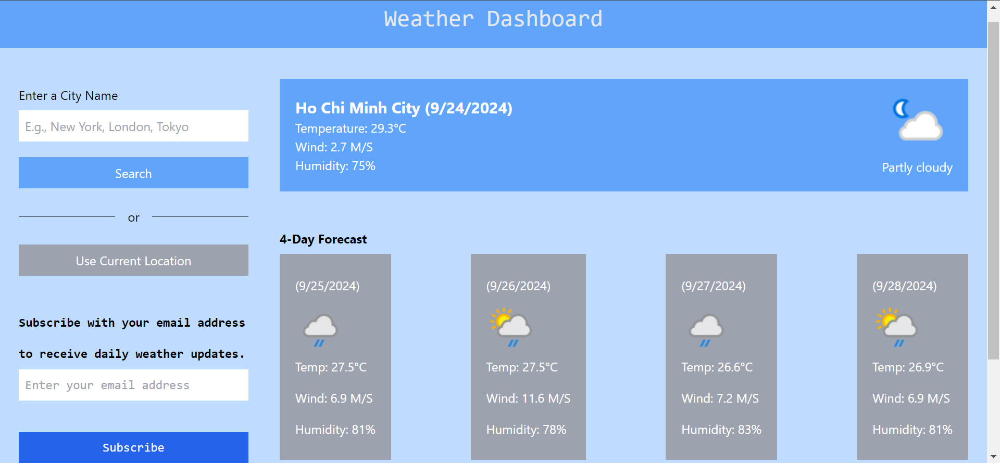
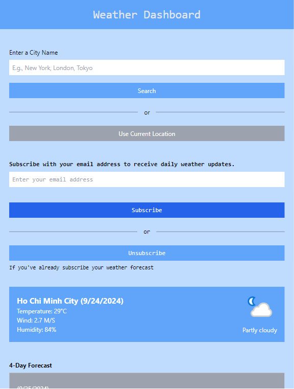

# Weather Dashboard 

## Laravel 11 (API) + ReactJS 18 (SPA)



*This is desktop viewing.*



*This is mobile viewing.*

Link to view project:

For frontend, go to [Frontend](https://golden-owl-intern-reactjs.vercel.app)

For backend, go to [Backend](https://golden-owl-intern-laravel.vercel.app)

## Or you may want to clone my project:

`git clone github.com/toi-la-qanh/Golden-Owl-Intern`

### Install backend : 
```
cd laravel
composer install
```

Copy the .env.example file to create a new .env file:

`cp .env.example .env`

Generate Application Key:

`php artisan key:generate`

### Install frontend:

```
cd reactjs
npm install
```

Install Tailwind CSS:

```
npm install -D tailwindcss postcss autoprefixer
npx tailwindcss init -p
```

Configure `tailwind.config.js` to include your paths:

```
module.exports = {
  content: ['./src/**/*.{js,jsx,ts,tsx}', './public/index.html'],
  theme: {
    extend: {},
  },
  plugins: [],
};
```

Add Tailwind to `index.css`:

```
@tailwind base;
@tailwind components;
@tailwind utilities;
```

### Run local server:

From your main project,

```
cd laravel
php artisan serve
```

Then, 
```
cd ..
cd reactjs
npm run dev
```